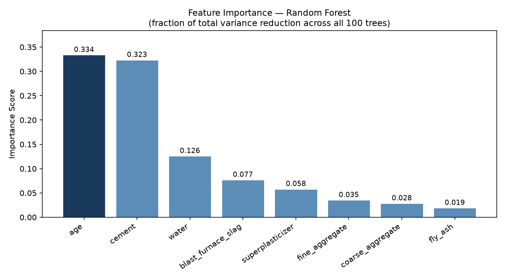
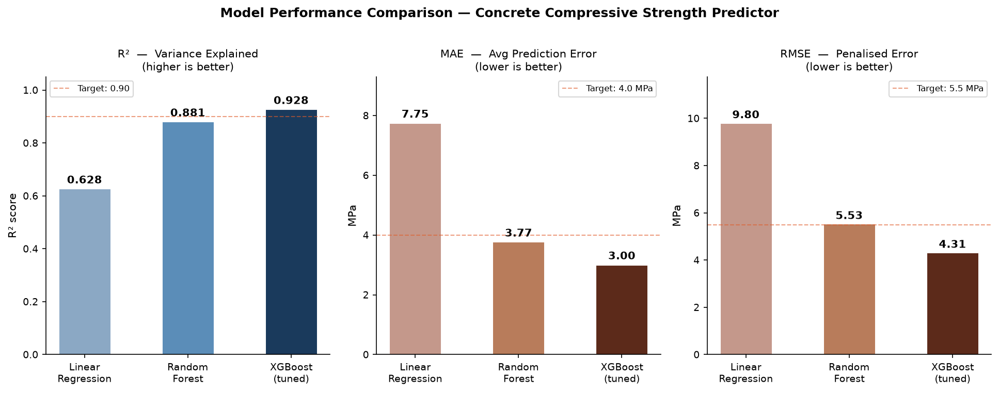
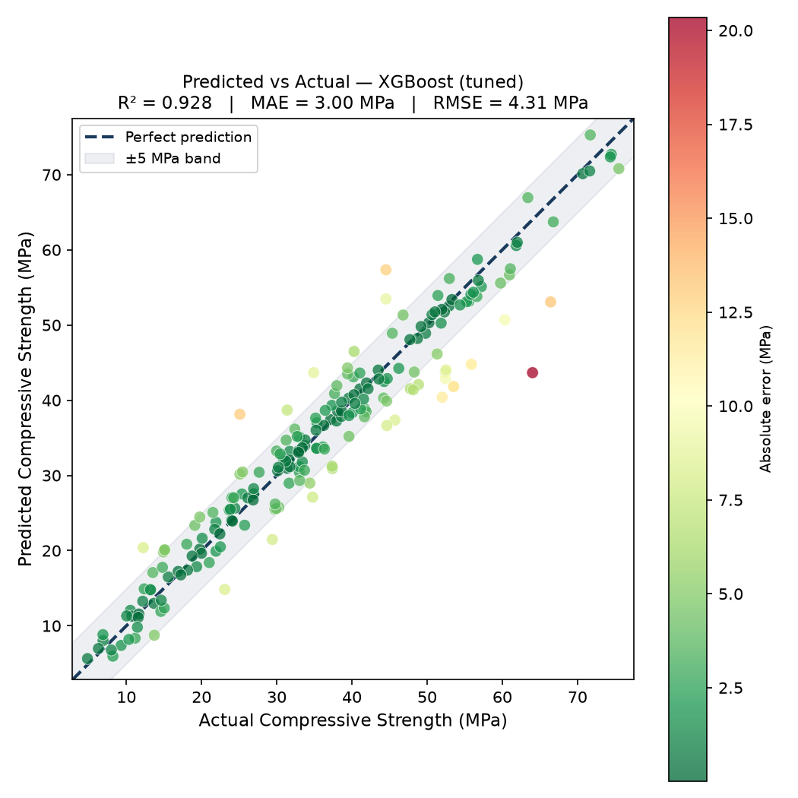
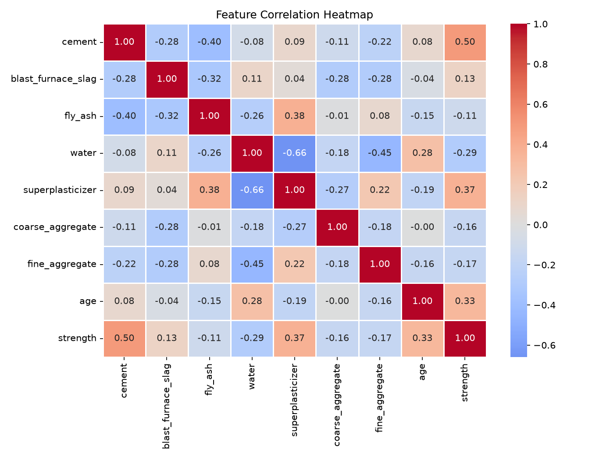

# Concrete Compressive Strength Predictor

Predicting concrete compressive strength from mix proportions using machine learning —
built as a demonstration of end-to-end ML pipeline development with Generative AI interpretation.

## Results

| Model | MAE (MPa) | RMSE (MPa) | R² |
|---|---|---|---|
| Linear Regression | 7.75 | 9.80 | 0.628 |
| Random Forest | 3.77 | 5.53 | 0.881 |
| **XGBoost (tuned)** | **3.00** | **4.31** | **0.928** |

XGBoost with GridSearchCV hyperparameter tuning achieves **R² = 0.928** —
explaining 92.8% of the variance in concrete compressive strength from
8 mix design features alone.

## Project Overview

**Dataset:** UCI Concrete Compressive Strength dataset — 1,030 samples,
8 features (cement, blast furnace slag, fly ash, water, superplasticizer,
coarse aggregate, fine aggregate, curing age), target: compressive strength in MPa.

**Domain context:** concrete compressive strength is driven by non-linear
interactions between ingredients — particularly the water-cement ratio.
This is why linear models underperform and tree-based ensemble methods excel.
Feature importance rankings from the Random Forest confirm what structural
concrete theory predicts: curing age (0.334) and cement content (0.323)
are the dominant factors, with water as the strongest negative contributor (0.126).

## Pipeline
Raw data (XLS) → pandas (EDA) → matplotlib/seaborn (visualization)
→ scikit-learn (train/test split, Linear Regression, Random Forest)
→ XGBoost + GridSearchCV (hyperparameter tuning)
→ Google Gemini API (plain-English interpretation)

## Visualizations

### Feature Importance — Random Forest

### Model Performance Comparison

### Predicted vs Actual — XGBoost

### Correlation Heatmap

## Generative AI Layer

After XGBoost predicts a compressive strength value, the input mix proportions
and prediction are passed to **Google Gemini 2.0 Flash** via the Generative AI API.
Gemini returns a 3-sentence domain-aware interpretation referencing EN 206
strength classes and specific mix adjustment recommendations.

**Example output (high-strength mix, predicted 67.4 MPa):**
> "This mix achieves EN 206 strength class C60/75, suitable for prestressed
> concrete elements and high-rise columns. The primary driver is the
> exceptionally low water-to-binder ratio (w/b = 0.27), made workable
> by the high superplasticizer dosage. To further increase strength,
> replacing 5–8% of binder with silica fume would refine the pore network
> and strengthen the interfacial transition zone."

This demonstrates the AI multiplier use case: combining a high-precision
ML model with a large language model to make technical outputs accessible
to non-technical project stakeholders.

## Tech Stack

| Category | Tools |
|---|---|
| Data | pandas, numpy |
| Visualization | matplotlib, seaborn |
| Machine Learning | scikit-learn, XGBoost |
| Generative AI | Google Gemini 2.0 Flash API |
| Environment | Python 3.12, PyCharm, Jupyter |

## How to Run

1. Clone the repo: `git clone https://github.com/nicolasrivoltaTUM/concrete-strength-predictor`
2. Install dependencies: `pip install pandas matplotlib seaborn scikit-learn xgboost google-generativeai python-dotenv`
3. Create a `.env` file with: `GEMINI_API_KEY=your-key-here`
4. Open `concrete_strength_predictor.ipynb` and run all cells

## Author

**Nicolás Ignacio Rivolta**
B.Sc. Civil Engineering — UNNE) ·
B.Sc. Information Engineering (TUM Campus Heilbronn)

Civil engineering domain knowledge informs feature interpretation throughout —
the model's findings are validated against structural concrete design theory
at every stage.